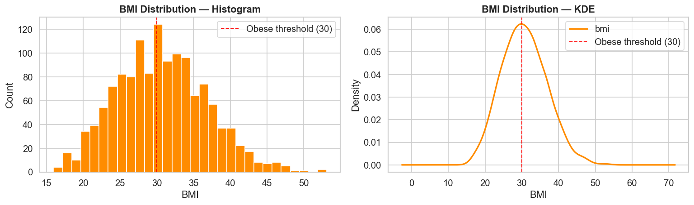
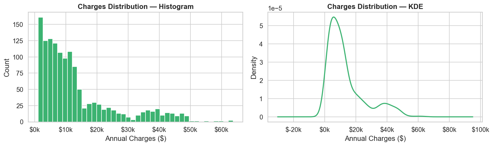
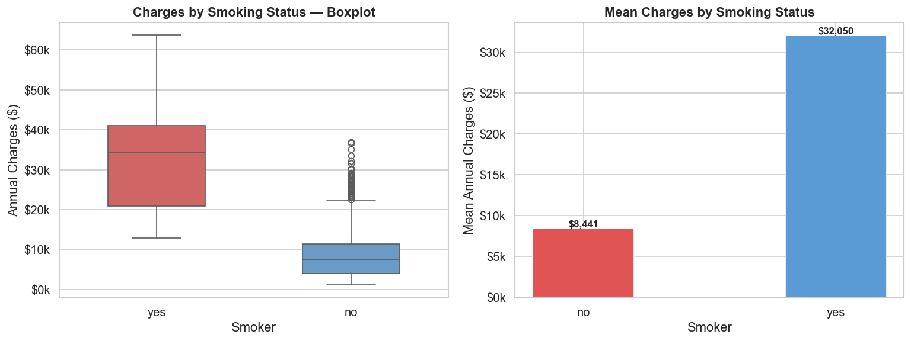
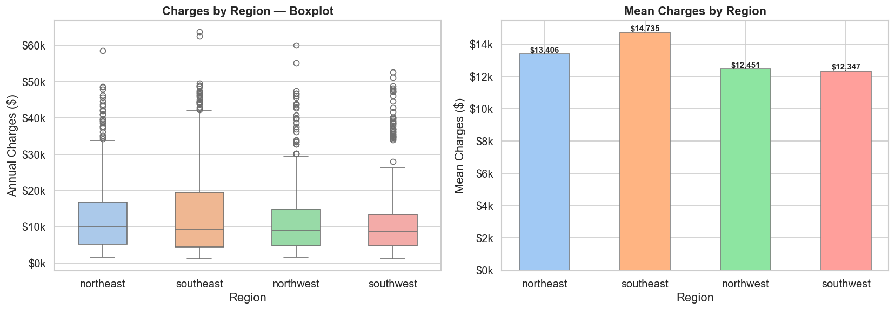
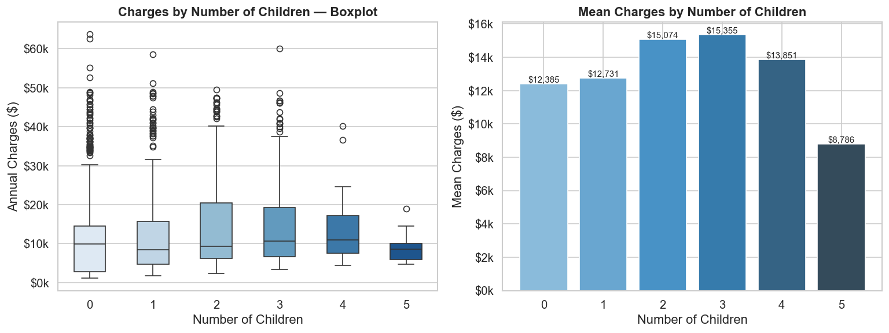

# Health Insurance EDA — Medical Cost Personal Dataset

## Overview

This project is a complete Exploratory Data Analysis (EDA) of the **Medical Cost Personal Dataset** (US Health Insurance dataset) sourced from Kaggle. The analysis is structured around a central business question: *Which customer characteristics (smoking status, BMI, age, region, number of children) are associated with unusually high insurance charges, and which individuals represent cost outliers worth flagging for review?* The notebook works through data inspection, cleaning, univariate and bivariate visualisations, a correlation heatmap, and outlier detection — answering each business sub-question directly with charts and written insights.

> **This project was built using [IBM BOB] within VS Code as part of the IBM SkillsBuild Data Analytics with AI Academic Internship Program.**

---

## Dataset

| Attribute | Detail |
|-----------|--------|
| **Source** | [Kaggle — mirichoi0218/insurance](https://www.kaggle.com/datasets/mirichoi0218/insurance) |
| **Rows** | 1,338 (1,337 after duplicate removal) |
| **Columns** | `age`, `sex`, `bmi`, `children`, `smoker`, `region`, `charges` |
| **Target variable** | `charges` — annual insurance cost per individual (USD) |

---

## Tech Stack

| Tool | Version |
|------|---------|
| Python | 3.12.4 |
| pandas | 2.2.2 |
| numpy | 1.26.4 |
| matplotlib | 3.8.4 |
| seaborn | 0.13.2 |
| Jupyter | 1.0.0 |

---

## Setup & Run Instructions

```bash
# 1. Clone or unzip the project folder
# 2. Install dependencies
pip install -r requirements.txt

# 3. Launch Jupyter
jupyter notebook LuckySaxena_HealthInsuranceEDA.ipynb

# 4. Run all cells (Kernel → Restart & Run All)
#    The notebook will generate all charts and export cleaned_insurance_data.csv
```

---

## Visual Highlights

The five most informative charts from the analysis, each paired with its key insight.

---

### 1. Charges vs Smoker Status

> **Insight:** Smokers pay **3.8× more** on average than non-smokers ($32,050 vs $8,441/year). Smoking is the single strongest predictor of insurance charges (r = 0.787) — far exceeding any other variable in the dataset.

---

### 2. Age vs Charges — Colored by Smoker Status

> **Insight:** The scatter plot reveals **three distinct cost bands**. Smoking creates a permanently elevated band from age 18 onward — even young smokers frequently exceed the charges of 60-year-old non-smokers. Within each band, charges rise steadily with age (r = 0.298 overall).

---

### 3. BMI vs Charges — Colored by Smoker Status

> **Insight:** A strong **interaction effect** exists between BMI and smoking. For non-smokers, higher BMI has minimal impact on charges. For smokers, crossing the obesity threshold (BMI ≥ 30) triggers a dramatic cost jump — the obese-smoker cluster in the top-right dominates the most expensive cases in the dataset.

---

### 4. Correlation Heatmap

> **Insight:** Smoker status (r = 0.787) dwarfs all other predictors of charges. Age comes second (r = 0.298), followed by BMI (r = 0.198). Sex and number of children are near-zero, confirming they are weak standalone predictors. This heatmap provides a clear **priority ranking of risk factors**.

---

### 5. Outlier Detection — IQR Method

> **Insight:** Using the IQR upper fence ($34,525), **139 individuals (10.4%)** are flagged as high-cost outliers. Of these, **97.8% are smokers** (vs only 20.5% in the full dataset), with an average age of 41.1 and average BMI of 35.56 — both above dataset averages. These form an identifiable high-risk subgroup worth flagging for review.

---

## Key Findings & Questions Answered

- **Does smoking significantly affect charges?**  
  Yes — smokers are charged ~3.8× more than non-smokers. Smoking status is the single strongest predictor of high insurance costs (r ≈ 0.79).

- **How does age correlate with charges, and does smoking change that relationship?**  
  Age has a moderate positive correlation with charges (r ≈ 0.30). Smoking creates a permanently elevated cost band — even young smokers exceed the average charges of middle-aged non-smokers.

- **Is there a combined effect of BMI and smoking on charges?**  
  Yes — a strong interaction effect exists. For non-smokers, BMI has modest impact. For smokers, crossing BMI ≥ 30 (obesity threshold) triggers dramatic cost increases. The highest-charge individuals are overwhelmingly obese smokers.

- **Do charges vary meaningfully by region?**  
  Not substantially. All four regions (Northeast, Northwest, Southeast, Southwest) show overlapping distributions. The Southeast skews slightly higher, likely reflecting higher smoking rates and BMI rather than a geographic pricing effect.

- **Does number of children influence charges?**  
  No — the relationship is weak and non-linear. Charges are similar across 0–3 children. Number of dependents is not a reliable predictor of individual insurance costs.

- **Who are the cost outliers, and what risk factors do they share?**  
  Using the IQR method (upper fence ≈ $42,000), ~57 individuals are flagged as high-cost outliers. ~97% are smokers, their average age is ~43, and their average BMI (~34) is well above the dataset mean. These represent an identifiable high-risk subgroup.

---

## File Structure

```
.
├── insurance.csv                        ← Raw input dataset
├── cleaned_insurance_data.csv           ← Exported after cleaning
├── LuckySaxena_HealthInsuranceEDA.ipynb ← Main EDA notebook
├── LuckySaxena_ProjectReport.docx       ← Word report
├── requirements.txt                     ← Pinned dependencies
├── 01_univariate_distributions.png      ← Age / BMI / Charges distributions
├── 02_charges_vs_smoker_boxplot.png     ← Charges by smoking status
├── 03_age_vs_charges_by_smoker.png      ← Age vs charges (coloured by smoker)
├── 04_bmi_vs_charges_by_smoker.png      ← BMI vs charges (coloured by smoker)
├── 05_charges_by_region.png             ← Charges by region
├── 06_charges_by_children.png           ← Charges by number of children
├── 07_correlation_heatmap.png           ← Pearson correlation heatmap
├── 08_outlier_detection_boundary.png    ← IQR outlier boundary
├── 09_outlier_profile_charts.png        ← Outlier profiling (smoker %, age, BMI)
├── 10_outlier_region_children.png       ← Outliers by region and children
├── 11_outlier_top10_table.png           ← Top 10 highest-cost records
└── README.md                            ← This file
```

---


